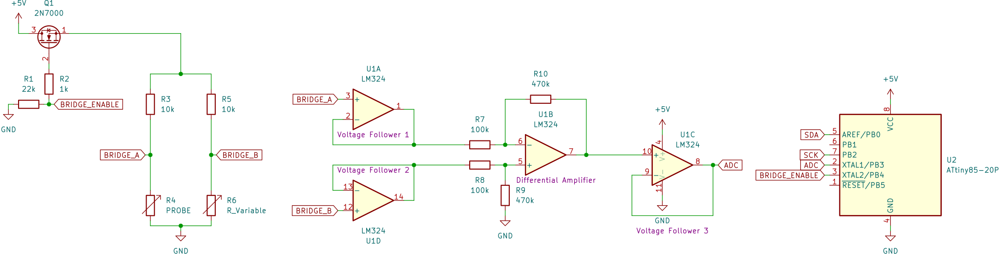
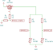
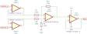
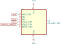

# Salinity Sensor

This sensor reports the relative change in salinity (conductivity) of water.

It uses a probe, an OPAMP and an ATtiny.

The salinity sensor probe exists out of two electrodes who are positioned with a certain distance between each other. With the electrodes under water there will flow a certain amount of current. When there is more salt, the resistance of the water will be lower so more current will flow.

We will be using a Wheatstone bridge with on one side the probe and on the other side a fixed (but adjustable) resistance. The two sides of the Wheatstone bridge are voltage dividers, on one side the voltage will change depending on the amount of salt, the other one is calibrated and will give a fixed voltage.
The two outputs from the Wheatstone bridge are connected to a differential amplifier which will output a voltage proportional to the voltage difference on the inputs. 

An ATtiny will, on request, read the output voltage of the differential amplifier and send it over I2C. 

## Wheatstone bridge

A Wheatstone bridge can be used to determine the value of an unknown resistance. In this case the unknown resistance is the resistance measured on the probe (R4). On the other side of the bridge a variable resistor (R6) is used to calibrate the Wheatstone bridge. When calibrating the bridge the value of R6 will be set to a value where the output of the sensor is in the middle of the reading window. When the conductivity of the water changes, the output of the sensor will be able to rise or fall accordingly.
The voltage on point A and point B can be calculated with the following formula. 

Q1 is an N-channel E-MOSFET which is used to enable or disable power to the Wheatstone bridge. When 5V is applied to the `BRIDGE_ENABLE` pin the MOSFET will conduct and power the Wheatstone bridge, the MOSFET is in *saturation mode*. When no voltage is applied the MOSFET will be in *cutoff mode* and act as an open switch.
 

## Amplifier

For reading the Wheatstone bridge, a LM324 or TL074 OPAMP is used. The two midpoints of the Wheatstone bridge first go through a voltage follower. A voltage follower acts as a buffer and has a very high input impedance and a very low output impedance. These characteristics are very useful to give a reliable signal to the differential amplifier. A high input impedance will result in a low current flow from the Wheatstone bridge thus almost no voltage drop will appear. A low output impedance makes the voltage follower ideal to read the voltage from.
A differential amplifier outputs a voltage proportional to the difference in voltage from its two inputs. R3 / R1 is the differential gain and by changing these values we can change the sensitivity of the sensor.

          
Connected to the differential amplifier we have another voltage follower to give reliable readings to the ATtiny.

## ATtiny

An Atmel ATtiny MCU will be used to read the output of the sensor and send it to another device. The ATtiny has a 10bit ADC (Analog to Digital Converter) which will be used to read the output voltage of the OPAMP. The ADC maps the input voltage to a number between 0 and 1024. To make the measurements more reliable a moving average filter is implemented on the ATtiny which outputs the average of a series of ADC readings. 
I2C will be used to communicate with the ATtiny.  
See [Sensor code](./Sensor%20code/) for more details on the ATtiny and the code.
