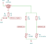
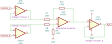
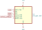
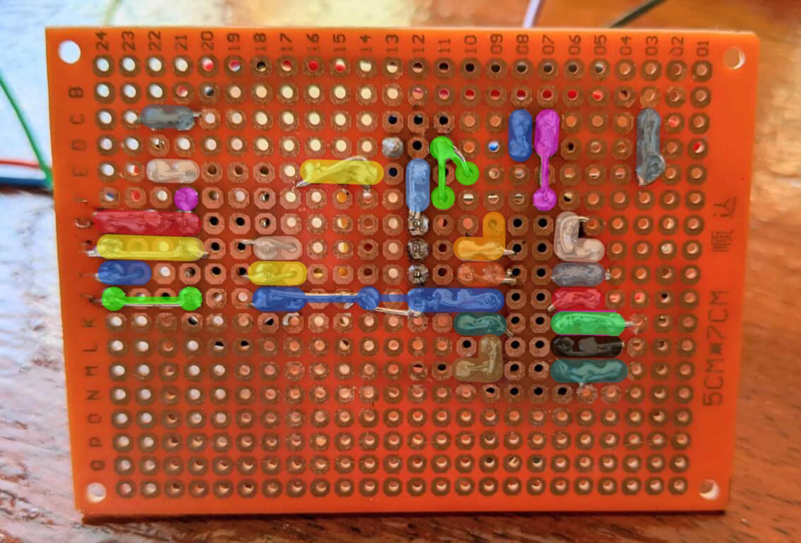
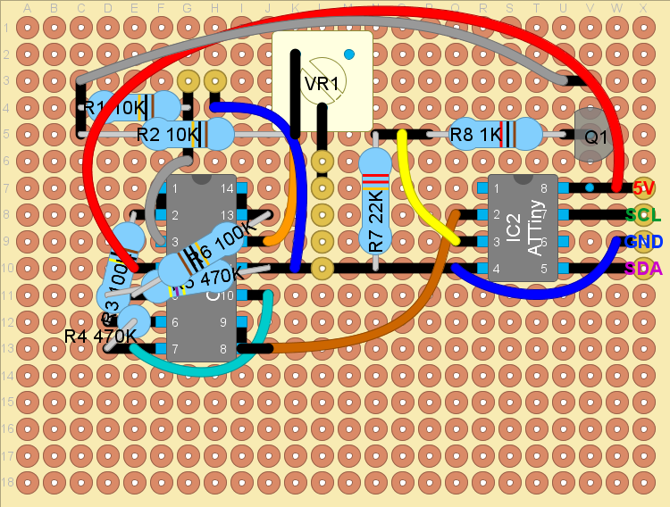
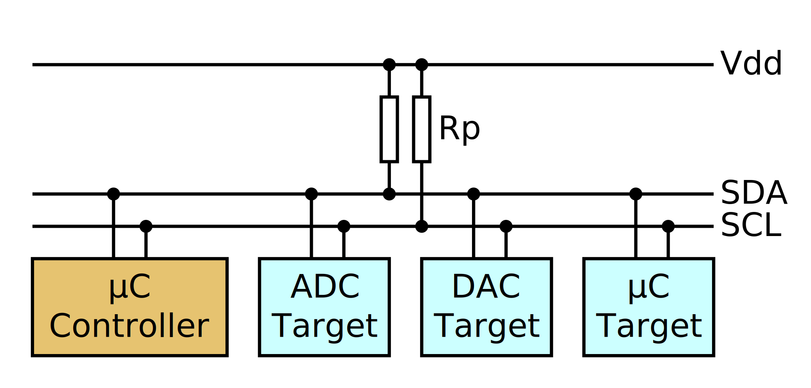
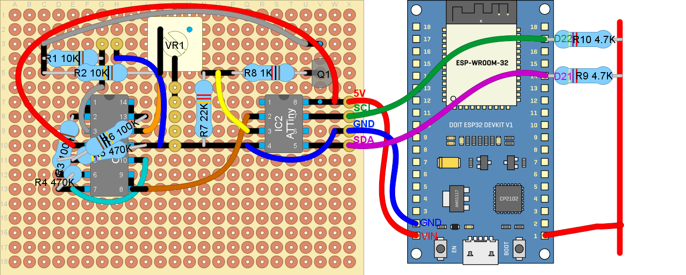

<!--
title: Internet of Things Workshop
theme: gaia
paginate: true
style: | 
  section {
    background-color: #fcf8ed;
  }
-->

# Internet of Things Workshop

## Salinity Sensor Prototype
## ESP32 & I<sup>2</sup>C


---

## Salinity Sensor


---

## Salinity Sensor


---

## Wheatstone bridge



- Two voltage dividers
- 
- Only enabled when needed

---

## Amplifier



- Voltage followers
  - Stable reading
- Differential amplifier
  - 

---

## ATtiny



- Reads Amplifier Output
- Moving Average Filter
- Sends Reading Over I<sup>2</sup>C

---

## ESP32 DOIT V1

- Microcontroller
- Arduino + WiFi & Bluetooth
- 30 pins


---

## Setting up the Arduino IDE

1. https://www.arduino.cc/en/software
2. Open "`File` > `Preferences` > `Additional Board Manager URLs`" and add: https://dl.espressif.com/dl/package_esp32_index.json
3. Open the Boards Manager at "`Tools` > `Board` > `Boards Manager`", search for "ESP32" and press the install button for "ESP32 by Espressif Systems"


---

## Testing Arduino IDE

1. Select "`DOIT ESP32 DEVKIT V1`" at "`Tools` > `Board`"
2. Select the correct COM port under "`Tools` > `Port`"
3. Choose an example program in "`File` > `Examples` > `Examples for DOIT ESP32 DEVKIT V1` > `WiFi` > `WiFiScan`" 
4. Program the code to the ESP32 with the Upload button (&#10145;)
5. Open the Serial Monitor via "`Tools` > `Serial Monitor`" and set the Baud-rate to "115200 baud"
6. If you can see the nearby WiFi networks everything is working!


<footer>
Source: https://microcontrollerslab.com/install-esp32-arduino-ide/
</footer>

---

## Soldering the Salinity Sensor





---



---


# Connecting to the Salinity Sensor

## Using I<sup>2</sup>C and an ESP32

---

## I<sup>2</sup>C

- I<sup>2</sup>C = Inter-Integrated Circuit
- Invented in 1982 by Philips 
- SDA = Serial Data Line
- SCL = Serial Clock Line
- Every target has his own address
''


---



---

## Send to serial monitor

```C++
void setup() {
  // put your setup code here, to run once:

}

void loop() {
  // put your main code here, to run repeatedly:

}
```

---

## Send to serial monitor

```C++
void setup() {
  Serial.begin(115200); // Open the serial port at 115200 baud
}

/* Send "Salamu, Dunia!" via serial every second. */
void loop() {
  Serial.println("Salamu, Dunia!"); // Send text over the serial port
  delay(1000); // Wait 1000ms or 1s
}
```
